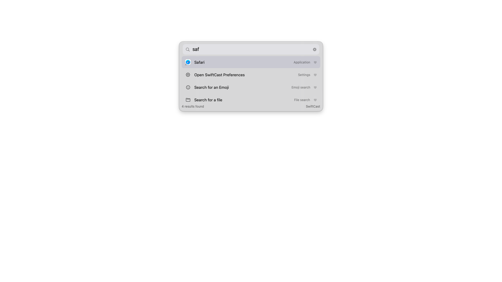

# SwiftCast ⚡️

A native Swift/AppKit/SwiftUI rewrite of [RustCast](https://github.com/MystikoLab/rustcast) —
a blazing-fast, Raycast-style popup launcher for macOS. SwiftCast replaces the
Rust/iced stack with pure Apple frameworks so every feature leans on the
platform directly.



## Features

**Search & launch**
- Fuzzy search across every installed app (LaunchServices discovery, real app icons)
- Usage ranking + ♥ favourites (pinned, persisted)
- Calculator (`12*3+2`, `sqrt(2)`, `sin(pi/2)`, `2^10` — safe recursive-descent parser)
- Unit conversion (`5 km to mi`, `100 f to c`, or `3 tbsp` for all sibling units) via Foundation `Measurement`
- Web search: end a query with `?` (or type ≥ 3 words) — configurable engine (default DuckDuckGo)
- Open URLs directly (`github.com`)
- Inline shell commands: type `> say hi`
- `quit <app>`, `quit all`, custom shell commands and modes from the config
- Window tiling: 12 positions (halves/quarters/thirds/maximize) for the frontmost window
- Easter eggs: `randomvar`, `67`, `lemon`, `zombo`, "Ferris Plushies"

**Pages** (switch with a search or a result)
- Main search
- File search — live Spotlight results via `NSMetadataQuery`
- Clipboard history (`cbhist`) — text/URL/image, SQLite-backed, preview pane,
  optional paste-on-select
- Emoji search — 6-wide grid, hover tooltips, Enter copies

**Platform-native plumbing**
- Global hotkeys via Carbon `RegisterEventHotKey` — no permissions needed
  (default toggle `⌥Space`, clipboard `⌘⇧C`)
- Borderless floating `NSPanel` with `NSVisualEffectView` vibrancy, appears on
  all Spaces, hides on focus loss, dynamic height (max 5 rows)
- Menu bar status item (`NSStatusItem`) with full menu
- Haptic feedback (`NSHapticFeedbackManager`), input-source restore (`TIS`),
  start-at-login (`SMAppService`), calendar events (`EventKit`)
- `swiftcast://` URL scheme, dark/light/system theming, custom fonts/colors,
  settings window (General / Appearance / Commands), config hot-reload (`⌘R`)

## Build & run

Requirements: macOS 13+, Xcode (built and tested with Xcode 27 beta / Swift 6.4).

```sh
./scripts/make_app.sh          # swift build -c release + assemble build/SwiftCast.app
open build/SwiftCast.app       # LSUIElement: lives in the menu bar
```

Press `⌥Space` (or click the ⚡️ menu bar icon → Toggle View) to open the launcher.

During development `swift run` works too (the app runs unbundled as a UIElement
process); the packaged bundle is required for the icon, URL scheme and
start-at-login.

## Keyboard

| Key | Action |
| --- | --- |
| `↑` `↓` / `Ctrl+P` `Ctrl+N` | Move selection (`←`/`→` by one cell on the emoji grid) |
| `Enter` | Open focused result |
| `Esc` | Clear query → back to main page → hide |
| `⌘1`…`⌘9` | Open the n-th result directly |
| `⌘R` | Reload config & app index |
| `⌘,` | Settings |

## Configuration

`~/Library/Application Support/SwiftCast/config.json` — created with defaults on
first launch. Notable keys: `toggleHotkey` / `clipboardHotkey` (syntax
`ALT+SPACE`, `SUPER+SHIFT+C`, `CTRL+ALT+T`, … — `SUPER` = `CMD`), `placeholder`,
`searchURL` (`%s` is the query), `mainPage` (`blank` / `favourites` /
`frequentlyUsed` / `events`), `windowLocation`, `theme` (mode, blur, colors,
font), `shells` (`{command, alias, hotkey?}`), `modes` (`name → script`),
`aliases` (`input → expanded query`), `blacklist`, `searchDirs`. Usage ranking
lives in `ranking.json` next to it, clipboard history in `clipboard.db`.

## URL scheme

`swiftcast://show`, `swiftcast://toggle`, `swiftcast://quit`,
`swiftcast://open?target=safari`, `swiftcast://page?name=emoji|clipboard|files`,
`swiftcast://query?text=…`, `swiftcast://settings` plus debug helpers
(`screenshot`, `capture` write window PNGs to `/tmp`).

## Project layout

See [PLAN.md](PLAN.md) for the Rust→Swift mapping table and architecture.
Sources live under `Sources/SwiftCast/` (`Model/`, `Search/`, `Services/`, `UI/`),
packaging in `scripts/`.

## Deviations from RustCast

- Favourites sort **above** other results (Raycast/Alfred convention)
- Empty query shows core built-ins instead of a blank pane
- No auto-updater yet; hotkey recording in settings is future work (edit the
  config JSON instead)
- Window tiling prompts for Accessibility permission on first use (same as the
  original); haptic tick on failure

## License

MIT, like RustCast. This project is an independent native rewrite; RustCast's
docs and defaults were used as the feature reference.
